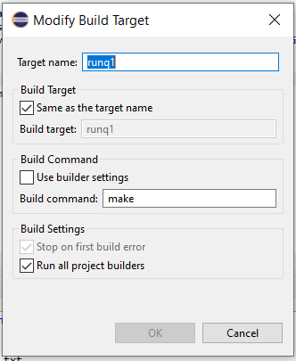
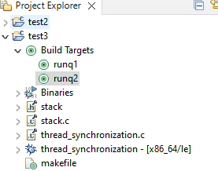

# Eclipse IDE for C Programming

Several different compilers are available to you, depending on your computer’s operating system and requirements.

- All the assignments for this course will need GNU Compiler Collection (gcc) compiler. Generally, you can use Cygwin/Xcode developer tools for most assignments, but some may require a Linux GCC compiler. 
- If you are comfortable with Eclipse, install it on your computer system by following the instructions from [Bohr](https://bohr.wlu.ca/cdt/usingEclipseCDT.php)[^1]. For GCC compiler, we will connect the docker container `gcc` setup above to Eclipse.

::: {.panel-tabset}
## Connecting to Docker Containers
- Once Eclipse is installed, there is a docker plugin for Eclipse, using which you can perform many of the mentioned Docker tasks from within Eclipse. To install the plugin in Eclipse, from the menu, click on Help --> install --> Eclipse Marketplace -->  Search for Eclipse `Docker Tooling` and install it.
-  You can switch to the `Docker Tooling perspective` (either click on the Open Perspective toolbar button at the top-right of the editor window or select from the Window | Perspective | Open Perspective | Other menu).
- Make sure your CDT for Eclipse is set up, open the perspective, and create a C programming project. 
- Open the Project Properties by right-clicking `Project > Properties`.
- In Properties, select `C/C++ Build > Settings` and open the `Container Settings` tab to set the following:
    - Configuration: Default [Active]
    - Connection: `http://localhost:2375` for Windows and on Mac  `unix:///var/run/docker.sock`
    - Image: gcc:latest (or any other name that you are using for docker containers)
- Check `Build Inside Docker Image`.
- Select the docker image to use. If there are no images listed, verify that Docker is running. 
- Click `Apply and Close`
- To compile the program: Click the `Build Icon` and Confirm that the console prints “Running in image...” 
- To run the program, either:
  a)
    - Create a Run Configuration with `Run > Run Configurations`.
    - Create a new C/C++ Container Launcher.
    - Pass the arguments needed, such as file names.
    - On the container tab, verify the gcc:latest image selected and click on Run.

  OR
  b)  Right-click on the project --> Build Targets -->  Create Targets and under that, create a name of the target, e.g., `runq1` and command `make` as given below:

  
   
   Click save and select the target to run the program under `Build Targets`. 

   

- Click the Run icon.
- Confirm that the console prints ```Running in image...```.

## Connecting to WSL2
-  If you chose to use WSL, then you can add Ubuntu Terminal to Eclipse:
- On Eclipse: Navigate to Windows -> Preferences -> Terminal -> Local Terminal
-   Add the following entry
-   name: WSL Bash
-   path: C:\\Windows\\System32\\wsl.exe
-   On the Project Explorer: On any file, right-click -> show in... -> WLS Bash. 
- It will open the project folder in the Terminal, and you can use the `Makefile` commands to execute your code.

:::

[^1]: Thanks to Mr. David Brown.