# Administration

In order to work effectively in this course, you must have the following:

- a Laurier email address.
- (an account on the department's Linux server `hopper`)[^1].

## Talking to `hopper`

For most of the assignments you will be using Linux Operating systems. With this option, you need `not` install any additional software on your system, rather you can work on your assignments using the department's Linux server `hopper`, named after `Rear Admiral Grace Hopper`, a pioneer in the computer science field. `hopper` is running Oracle Linux 7. If you want you can use any SSH client software like putty to login into the hopper terminal. 

## Your `hopper` unix Account

When you connect `hopper` via ssh to opens a simple console window that gives you command line access to your account on `hopper`. The account uses your Laurier login based upon your surname and student ID number.

When logging in the console window will ask information for the first time something like this:

- You are first asked for your login, then for your password. 
- Your password is not displayed as you type it. 
- Press the enter key when you have finished typing your password. 
- `hopper` then gives you the system command-line prompt. (Note: when logging into `hopper` you may not be asked for your password as it is picked up from the machine you are running putty on. This is not a problem.)
- You may be asked to accept an SSH key - answer 'Yes'. 

The system command-line prompt (hereafter 'prompt') tells you where in the `hopper` file system you are currently located. In the example above, the user `dbrown` has an account in the /home/dbrown folder. As you move through the file system the prompt changes to match your current location. For most intents and purposes you have legal access to your folder in /home and any subfolders you may create only. You have read access to numerous other folders on the system, mostly for access to software. This will be discussed in greater detail in later lectures.

To log out of your account and automatically close the SSH client window, type exit , followed by the Enter key.

The default `hopper` shell is `bash`. If you wish to change to another shell you are welcome to do so, but all examples are done in `bash`. (If you have no idea what this means, then leave it alone.) and has `gcc` already installed.

The terminal allows you to copy and paste from its terminal window. To copy, use your mouse to highlight the text you wish to copy - it is automatically copied to the PC's clipboard. To paste into the terminal window right-click anywhere in the window with the mouse cursor and the clipboard text will be pasted at the current location of the text cursor (not the mouse cursor).

## Editing

You will be editing, compiling, and executing C programs and shell scripts on `hopper` . There are a number of editors available on `hopper`, but by far the most powerful is `emacs`.

To start `emacs` simply type emacs at the prompt/terminal.

Before we can create a C program we need to create a directory to put it in. To create a CP386 directory in your account, type the following commands at the prompt:

```bash
mkdir CP386
cd CP386
```

The first command creates a new directory ( mkdir - Make Directory) in your account named CP386. The second command moves your 'focus' to that directory ( cd - Change Directory). You should see that your prompt now shows CP386 as part of it to indicate that you are in the CP386 directory.

Now you can create program files in the CP386 directory. To start emacs with a file (your normal approach), type emacs filename at the prompt, as in this example:

```bash
emacs ctest.c
```
which allows you to enter editing in Emacs

`emacs` is designed to work with dozens of terminal types, and they all have their own quirks and specific types of interface. We will concern ourselves only with the keys and commends that work with `hopper` and putty in our labs. Should you connect to `hopper` from another type of terminal be aware that some of the key associations mentioned here may not work with those types - you are responsible for finding alternatives.

The three most important keys in emacs are:

- The CTRL key, denoted as C- . Hold down the actual keyboard Ctrl key in combination with whatever other key is noted. Example: to exit emacs , press C-x C-c
- The META key, denoted as M- . Press and release the actual keyboard Esc key followed by the next required key. Example: to move to the next word, press M-f
- The MENU key, to activate the emacs menu bar. Press the F10 function key to bring up the menu.
  
The cursor control (arrow) keys work as you would expect, and the Backspace key deletes characters to its left. The Delete key does nothing (which can be a problem).


::: {.panel-tabset}
## VSCODE

### Step 1 — Installing the Remote-SSH Plugin

- Open the Extensions Marketplace by clicking the bottom icon on the left sidebar (four squares with one exploding out).
- Search for "Remote-SSH" and click Install.
- Then search for "Remote Explorer" and click Install.
- You can also access this section by pressing `Ctrl+Shift+X`. When you open this page you will see suggested plugins to download and install.

### Step 2 — Configuring the Remote-SSH Plugin and Connecting to `hopper`

- Now that you have the plugin installed you can configure it to connect to a server. To do so, you’ll need the following pieces of information:
- The server’s IP or hostname: hopper.wlu.ca
- The username you’ll connect with.

- You’ll use this information to create an SSH configuration file that Visual Studio Code can use to SSH to the server to sync files and execute code on your behalf. You will create this configuration using Visual Studio Code.
- Now you have Remote Explorer, you will see a TV like symbol on the left-hand side of the IDE there is a vertical row of  icons.


- To make setup easy, the extension can guide you through adding a host.

- Start by clicking on the Add New icon in the SSH Remote Explorer in the Activity Bar.

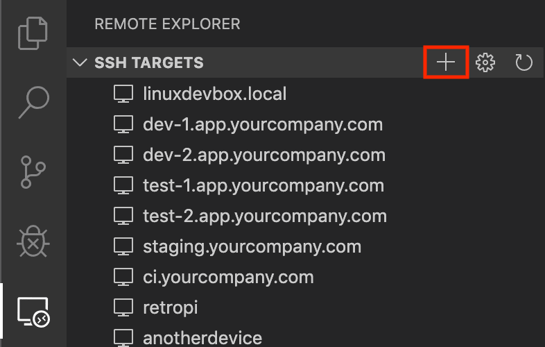

- You'll then be asked to enter the SSH connection information. You can either enter a host name or the full ssh command you would use to connect to the host from the command line:

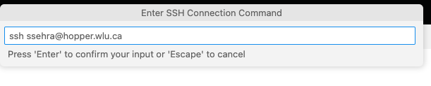

- Then it will ask you to enter the password

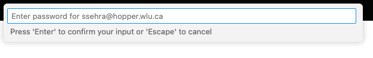

- Finally, you'll be asked to pick a config file to use

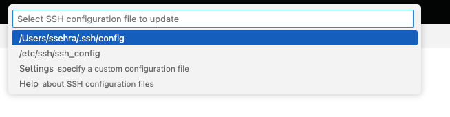

- The on lower right corner of the you will be prompted with connection information

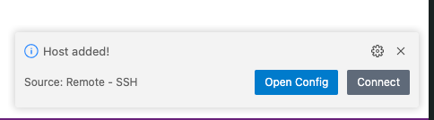

If it correct you will be prompted to allow the connection.

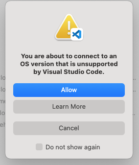

- Now, the window will open next step is to connect to folder `CP386`. On left panel select `open folder` and choose it.

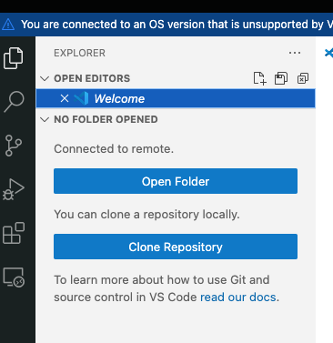

Then, select

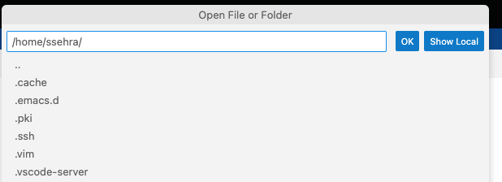

- Lastly, allow the connection and trust the authors.

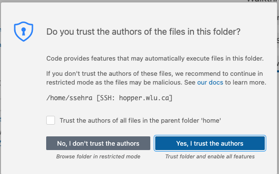

Your VSCode IDE is set to start programming with `hopper` Linux.

## Eclipse

### Use Remote System Explorer Eclipse Plugin:

- To code directly with VirtualBox Ubuntu Machine on all the operating systems, follow below steps to install Remote System Explorer plugin to Eclipse:
- To get Remote System Explorer via Software Updates: From your running instance of Eclipse, choose Help > Install New Software.... to open the software installation wizard.
- In case an update site is not pre-configured, visit https://www.eclipse.org/tm/downloads.php for finding the latest update site to use. 
- Type "Remote" in the filter box and press ENTER to find the RSE downloads; for the stand-alone Terminal view, find "Terminal". Select what you want to install and finish the wizard.

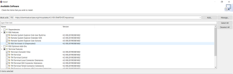

### Open the RSE Perspective: 

The first step to connect with Remote Machine (Ubuntu Machine on VirtualBox) is to open the RSE Perspective. Follow the steps below to begin this process. 

1.	Open the Eclipse application
2.	Select Window -> Open Perspective -> Other...
3.	Select Remote System Explorer as shown in Figure below. The list of available perspectives may differ depending on which plugins are installed in Eclipse.

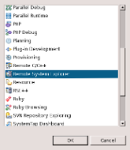

### Create a Remote Connection: 

This set of configuration steps assumes that Eclipse has the RSE Perspective active. Follow the steps:

1.	Right-click anywhere in the Remote Systems view 
2.	Select New -> Connection... (Figure below). 
3.	Select General -> SSH Only (Figure below) and click Next > in the Select Remote System Type dialog. 

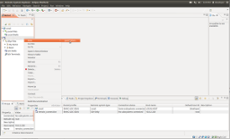

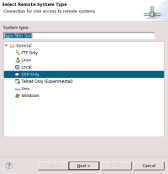

### Enter the following information:

- Enter the hostname of the target home (hopper.wlu.ca) in the Host name: field 
- Optionally, enter a Connection name and Description 
- Leave all other options set to their defaults 

### Initiate an RSE Connection: 
To use the new connection: 

1.	Right-click on the new connection created above in the Remote Systems View. 
2.	Select Connect 
3.	Set the User ID to the LAURIER ID. 
4.	Set the your Laurier Password.

Your Eclipse IDE is set to start programming with `hopper` Linux.

:::

[^1]: Thanks to Mr. David Brown.