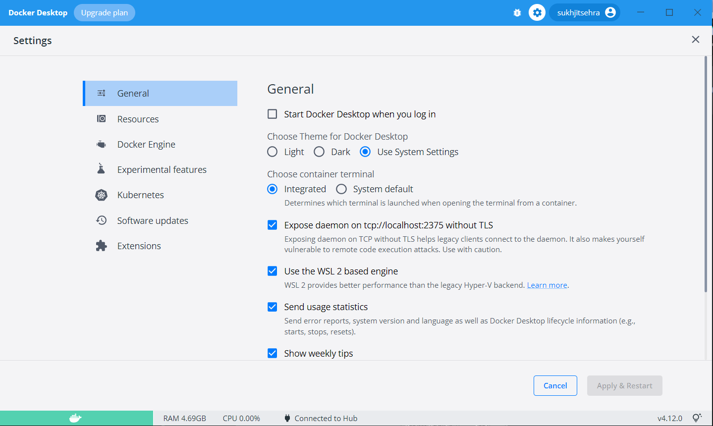

# Linux Installation using Docker Containers

Linux containers comprise a considerable percentage of the overall container ecosystem and are fundamental to developer experiences and production environments. It is now possible to install Linux on Windows/MacOS using the power of Docker technology.

::: {.panel-tabset}

## Windows

- Download Docker for Windows from [Docker Store](https://store.docker.com/editions/community/docker-ce-desktop-windows).

- Then, double-click on the `Docker Desktop Installer.exe` to run the installer.

-  Once you start the installation process (`note for Windows: always enable Hyper-V Windows Feature on the Configuration page`).

- Then, follow the installation process to allow the installer and wait till the process is done.

- After completion of the installation process, click `Close and Restart`. 

- Start `Docker Desktop Tool`.

Note: After the installation process is complete, the tool does not start automatically. To start the Docker tool, search for the tool, and select Docker Desktop in your desktop search results.

- Before starting the application, Docker offers an onboarding tutorial. The tutorial explains how to build a Docker image and run a container. 

- You are now successfully running `Docker Desktop` on Windows.

- For C programming development, we will be using a docker image of the GCC compiler; kindly follow the steps:

- Open `Windows PowerShell` and command prompt type `docker info` if you see a long message about the Docker and its parameters. Then proceed to the following steps, but if you see an error message, make sure to start the docker desktop app. 

## MacOS

- Download Docker for Mac from [Docker Store](https://docs.docker.com/desktop/install/mac-install/) based on the chip.

- Then, double-click on the `Docker.dmg` to run the installer.

- Then, follow the installation process to allow the installer and wait till the process is done.

- After completion of the installation process, click `Close and Restart`. 

- Start `Docker Desktop Tool`.

Note: After the installation process is complete, the tool does not start automatically. To start the Docker tool, search for the tool, and select Docker Desktop in your desktop search results.

- Before starting the application, Docker offers an onboarding tutorial. The tutorial explains how to build a Docker image and run a container. 

- You are now successfully running `Docker Desktop` on Windows/Mac.

- For C programming development, we will be using a docker image of the GCC compiler; kindly follow the steps:

- Open `Terminal on Mac` and command prompt type `docker info` if you see a long message about the Docker and its parameters. Then proceed to the following steps, but if you see an error message, make sure to start the docker desktop app. 
        
:::

- Now, type `docker pull gcc` it will take some time, and go to the next step when done.

- type ```docker run -d -t --name cp386_container gcc:latest``` to run the container. 

- Once you become comfortable with the docker containers, you can use the following commands to start, stop and run the container.
    - To stop the container, use ```docker stop cp386_container``` command.
    - To start the container, use ```docker start cp386_container``` command.

- The last step on `Windows` is to go to the docker desktop app --> settings and check the option “Expose daemon on tcp://localhost:2375 without TLS” and save and restart the `Docker Desktop` app.



