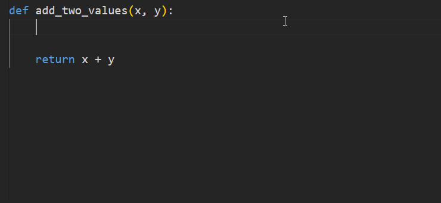

# Getting Started with VS Code

- Open VS Code and then use `File > Open Folder` to open the project folder e.g. `hello-world` folder on your computer (@MicrosoftPythonVSCode2023).
- Now, in the `Explorer view`: hover over the title bar and select `New File`.
- Name the new file `hello.py` by entering it into the new toolbox and pressing `Enter`.
- Enter the `print('Hello, World!')` Python code in the editor panel. This command uses the print function to display the text Hello, World! when your application is run.

- Save the file by selecting File and save option.

- Now, you are ready to explore and code fun in VSCode. 

## Run your application
Since it's a single line program, you can actually run your application from inside VSCode. Before that select the Python interpreter, by opening the `Command Palette (Shift + Command + P (Mac) / Ctrl + Shift + P (Windows/Linux))`, start typing the `> Python: Select Interpreter` command to choose the Python interpreter or enter the Path  to the Python interpreter. 

:::{callout-note}
`> Python: Select Interpreter` will present a list of interpreters that are availabel on your system, those can be used for your project. Best, select the one that you installed recently.
:::

### Via Terminal:

1. Open the built-in terminal in VSCode by selecting View and Terminal.
2. In the new terminal window, run the  `python hello.py` command to run your Python code. `Hello, World!` appears in the terminal window. 

### Via Run Button:

1. Click the `Run Python File in Terminal` **play button** in the top-right side of the editor and `Hello, World!` appears in the terminal window. 

Congratulations! For your first Python program.

## Adding Docsrting to your Program

There are several formats to add to add documentation to your program, some most popular ones are:

- google
- sphinx
- pep257

We will use a custom.template to  add documentation to your program. Download the [custom template](custom.mustache) (right-click and save) and follow the steps to add it to VS code. 

1. After downloading the custom.mustache file, open the `Settings editor`, use the following VS Code menu command:
    - On Windows/Linux - File > Preferences > Settings
    - On macOS - Code > Preferences > Settings
2. When you open the Settings editor, you can search and discover the settings to look for `AutoDocString`.
3. Find the option: `Auto Docstring: Custom Template Path` and enter the file path to custom docstring template file `custom.mustache` (File path can be absolute or relative to the project root.)
4. To add the docstring, first create the function e.g. a python function to add two integer values, as given below:

    ```
    def add_two_values(x, y):
    return x + y
    ``` 

   - To generate the docstring, place the cursor in the line directly below the function definition (i.e. below the def keyword) and perform any one of the following steps:

   - Start the docstring with either triple double or triple single quotes and press the Enter key
   - Use keyboard shortcut `CTRL+SHIFT+2` for windows or `CMD+SHIFT+2` for macOS.

       

   - This will populate the function body in the following manner. The _description_, _usage_, and _type_ are placeholders that we need to replace with actual descriptions.

   - autoDocString can populate the _type_ placeholder automatically by inferring parameter types 

