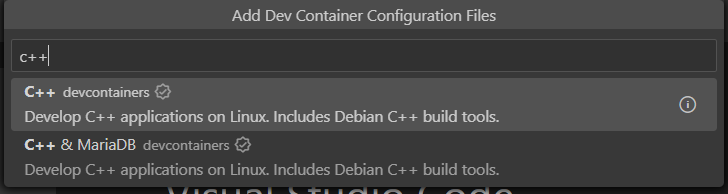
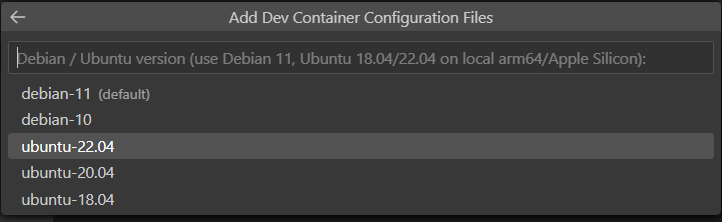
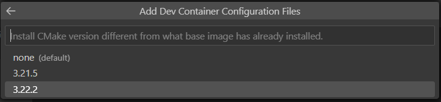
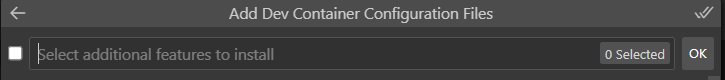

# Visual Studio Code Installation

- In your browser, navigate to [Visual Studio Code download](https://code.visualstudio.com/download) page. The web page displays logos for Windows, macOS, and Linux

- Download the VSCode installer for Windows/Mac/Linux. Once it is downloaded, run the installer. 

- After accepting all the requests, press the finish button.

- Open the  VSCode to verify the installation. 

- Now, install the `Remote Development extension` pack. It will let us open any folder in a container, on a remote machine, or in the Windows Subsystem for Linux (WSL) and take advantage of VS Code’s full feature set.

:::{.panel-tabset}
## Connecting to VirtualBox

If you installed Ubuntu in VirtualBox, VS Code can connect directly to the Linux virtual machine using **SSH**. Your programs will run inside Ubuntu while you use VS Code on your Windows or macOS computer.

### 1. Install and Start SSH in Ubuntu

Start the Ubuntu virtual machine and log in. Open a terminal and run:

```bash
sudo apt update
sudo apt install openssh-server -y
```

Enable and start the SSH service:

```bash
sudo systemctl enable --now ssh
```

Verify that SSH is running:

```bash
sudo systemctl status ssh
```

You should see:

```text
Active: active (running)
```

### 2. Configure VirtualBox Port Forwarding

Shut down the Ubuntu virtual machine.

In VirtualBox, select the Ubuntu VM and open:

**Settings → Network → Adapter 1**

Make sure:

```text
Attached to: NAT
```

Click **Port Forwarding** and add the following rule:

| Setting | Value |
|---|---|
| Name | SSH |
| Protocol | TCP |
| Host IP | 127.0.0.1 |
| Host Port | 2222 |
| Guest IP | Leave blank |
| Guest Port | 22 |

Save the settings and start the Ubuntu virtual machine again.

### 3. Test the SSH Connection

On your main Windows or macOS computer, open Terminal or PowerShell and run:

```bash
ssh -p 2222 username@localhost
```

Replace `username` with your Ubuntu username.

For an OSBoxes image, for example:

```bash
ssh -p 2222 osboxes@localhost
```

Enter your Ubuntu password when prompted.

The first time you connect, type:

```text
yes
```

If you see the Ubuntu command prompt, the SSH connection is working.

Type:

```bash
exit
```

to disconnect.

### 4. Install the Remote Development Extension in VS Code

Open VS Code and open the Extensions view:

- Windows/Linux: `Ctrl+Shift+X`
- macOS: `Cmd+Shift+X`

Search for and install:

```text
Remote Development
```

### 5. Connect VS Code to Ubuntu

Open the Command Palette:

- Windows/Linux: `Ctrl+Shift+P`
- macOS: `Cmd+Shift+P`

Search for:

```text
Remote-SSH: Connect to Host...
```

Select:

```text
Add New SSH Host...
```

Enter:

```bash
ssh -p 2222 username@localhost
```

For example:

```bash
ssh -p 2222 osboxes@localhost
```

Select the suggested SSH configuration file.

Open the Command Palette again and select:

```text
Remote-SSH: Connect to Host...
```

Choose the Ubuntu connection you just created.

If prompted for the operating system, select:

```text
Linux
```

Enter your Ubuntu password when requested.

### 6. Open Your Linux Workspace

A new VS Code window will open and connect to the Ubuntu virtual machine.

Select:

**File → Open Folder**

and open your Linux home directory, for example:

```text
/home/username/
```

or, for OSBoxes:

```text
/home/osboxes/
```

Open a terminal in VS Code using:

**Terminal → New Terminal**

The terminal is now running inside your Ubuntu virtual machine.

You can verify the connection using:

```bash
uname -a
```

You can also verify that the required development tools are available:

```bash
gcc --version
g++ --version
make --version
java -version
python3 --version
```

You can now edit, compile, and run your programs in Ubuntu directly from VS Code.


## Connecting to Docker Containers

- To open a CP386 workspace in a Linux environment and using IDE, follow the steps:

- Start VS Code, run the Dev Containers: Open Folder in Container... command from the Command Palette (F1) or quick actions Status bar item, and select the project folder you would like to set up the container for:

- Now, pick a starting point for your dev container and follow the steps below:
- Step 1:


- Step 2:


- Step 3:


- Step 4:



- The VS Code window will reload and start building the dev container. A progress notification provides status updates. Now, you can open Terminal and can run makefile. Enjoy your programming. 


## Connecting to WSL2

-  If you chose to use WSL then you can connect VSCode to WSL2:
- Start VS Code.
- Press F1, select WSL: New WSL Window for the default distro or WSL: New WSL Window using Ubuntu for a specific version.
- Use the File menu to open your folder.

:::

## VSCode Extensions

### autoDocstring Extension

`Docstrings` help understand code functionality and are essential for writing clean and well-documented programs. This `extension` will assist you in automatically creating default documentation whenever you create a new a Python function (@AutodocstringExtension). 

The [autoDocstring extension](https://marketplace.visualstudio.com/items?itemName=njpwerner.autodocstring) helps us quickly generate docstring for Python functions. By typing triple quotes """ or ''' within the function, we can generate and modify docstring. 

1. In VSCode, select View -> Extensions or press Ctrl+Shift+X (Cmd+Shift+X on macOS) to open the Extensions view. It will display all the extensions available for VSCode.
2. In the search bar at the top of the Extensions view, type "AutoDocString".
3. From the search results, locate the "AutoDocString" extension by Nils Werner and select "Install".
4. After installation, the button will change to "Reload" - click on it to reload Visual Studio Code and activate the extension.